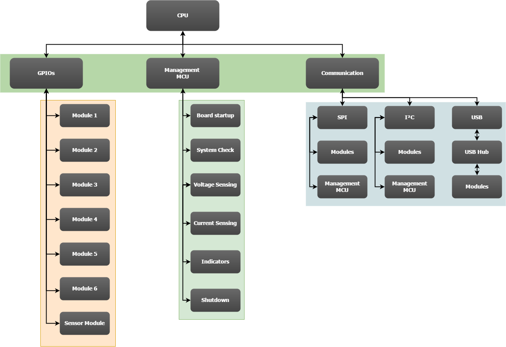
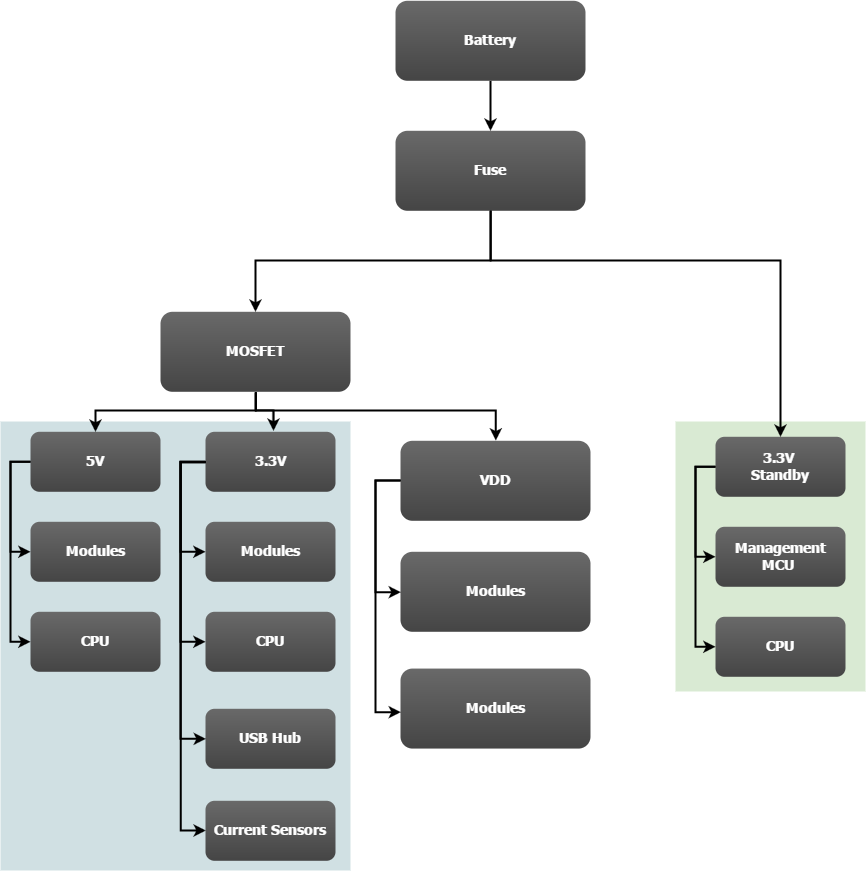

# System Overview.

The Motherboard has seven identical slots for $`35mm\times 40mm`$ modules which
are connected to a single CPU module slot which has up to seventy general purpose
inputs and outputs (GPIO), as well as $`SPI`$, $`I^{2}C`$, and $`USB`$ communication buses.
The Motherboard also supplies each module with a direct battery connection
and additionally regulated 5V and 3.3V lines.

## Block Diagram

## License

This work is licensed under a [Creative Commons Attribution-NonCommercial-ShareAlike 4.0 International License](https://creativecommons.org/licenses/by-nc-sa/4.0/legalcode)

**Attribution** — You must give [appropriate credit](/license/credit.md), provide a link to the license, and
[indicate if changes were made](https://wiki.creativecommons.org/License_Versions#Modifications_and_adaptations_must_be_marked_as_such).
You may do so in any reasonable manner, but not in any way that suggests the licensor endorses you or your use.

**NonCommercial** — You may not use the material for [commercial purposes]().

**ShareAlike** — If you remix, transform, or build upon the material, you must distribute your contributions under the [same license]() as the original.

